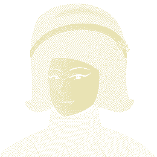
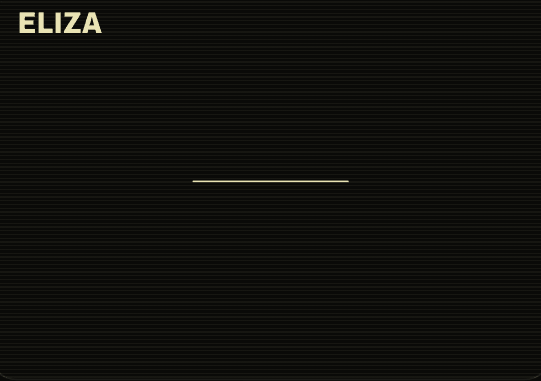
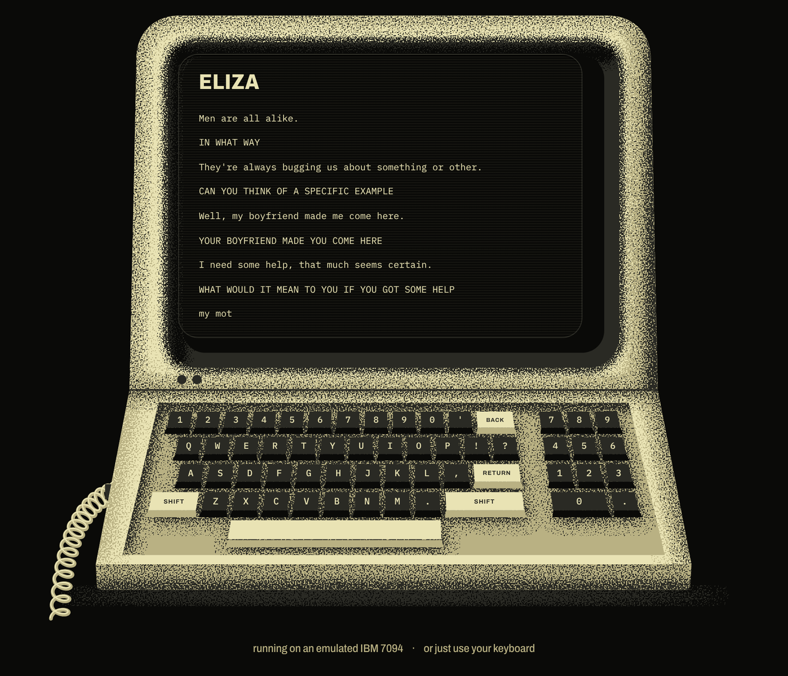
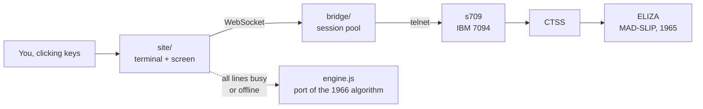
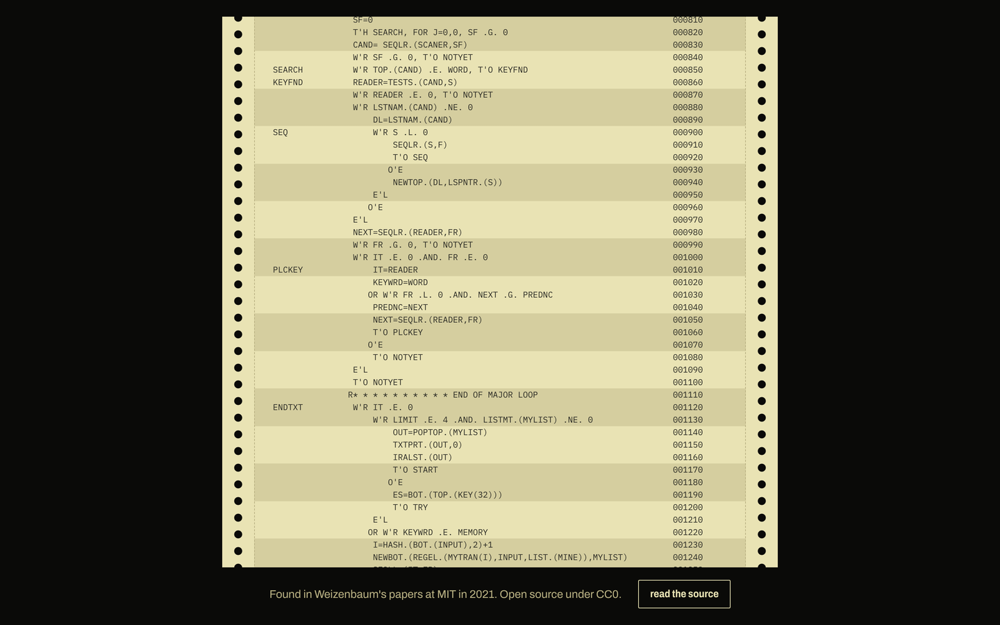
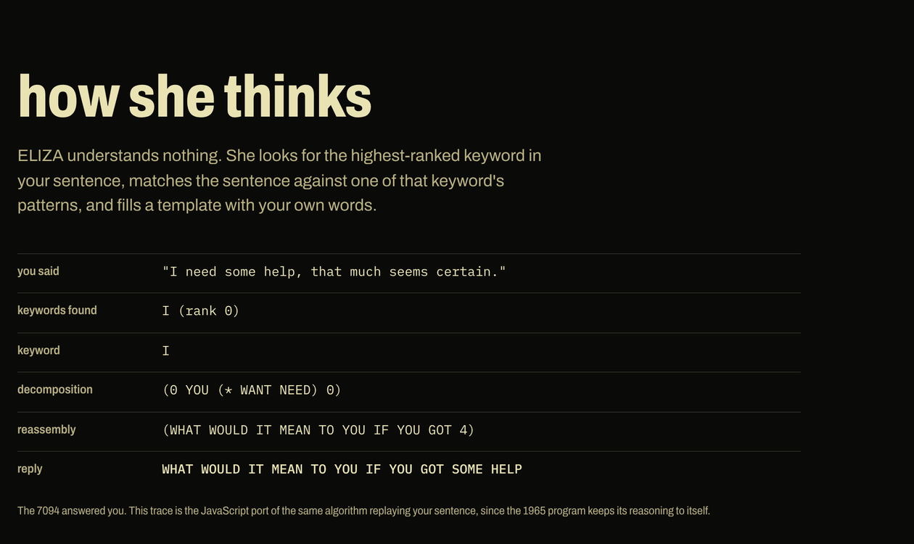

<div align="center">



# $ELIZA1966

**The first chatbot ever written, running its original 1966 code,<br>on a machine you type into with your mouse.**

[](https://github.com/elizafirstai/eliza1966/actions/workflows/test.yml)
[](LICENSE)
[](original/)
[](bridge/)
[](#is-it-really-her)
[](#eliza1966-on-solana)



</div>

In 1966 Joseph Weizenbaum at MIT published ELIZA, a program that talked like a psychotherapist by turning your own sentences back on you. The printout of his original code was found in the MIT archives in 2021 and released as open source. This project puts that code back on an IBM 7094, behind a cream terminal you poke one key at a time.

<p align="center"></p>

## Is it really her?

Yes. There is no language model anywhere in this repository, and nothing is generated. Her brain is three things you can check.

**1. The original source.** [`original/eliza.mad`](original/eliza.mad) is Weizenbaum's MAD-SLIP program, transcribed card by card from the printout, with the DOCTOR script from the 1966 paper in [`original/tape.200`](original/tape.200).

**2. The original machine.** That code is compiled and run inside CTSS, MIT's time-sharing system, on the s709 IBM 7094 emulator ([`bridge/`](bridge/)). This is an unedited session, recorded while building this repo ([full log](docs/ctss-session.txt)):

```
r eliza
W 138.1
EXECUTION.
WHICH SCRIPT DO YOU WISH TO PLAY
200
HOW DO YOU DO . PLEASE TELL ME YOUR PROBLEM
INPUT
Men are all alike.

IN WHAT WAY
INPUT
Well, my boyfriend made me come here.

YOUR BOYFRIEND MADE YOU COME HERE
```

**3. A port that is tested against 1966.** When every emulated machine is busy, the site falls back to [`site/js/engine.js`](site/js/engine.js), a line-by-line port of the algorithm in the paper, reading the same script. CI replays the conversation printed in the paper on every push, and every reply has to match word for word, down to the last one, which comes from ELIZA's MEMORY and the original SLIP `HASH` function over 7094 BCD:

| you | ELIZA, 1966 |
|---|---|
| Men are all alike. | IN WHAT WAY |
| They're always bugging us about something or other. | CAN YOU THINK OF A SPECIFIC EXAMPLE |
| Well, my boyfriend made me come here. | YOUR BOYFRIEND MADE YOU COME HERE |
| He says I'm depressed much of the time. | I AM SORRY TO HEAR YOU ARE DEPRESSED |
| … 10 more … | … |
| Bullies. | DOES THAT HAVE ANYTHING TO DO WITH THE FACT THAT YOUR BOYFRIEND MADE YOU COME HERE |

The site always says which one is answering, under the terminal: **running on an emulated IBM 7094**, or **faithful port, emulator offline**.

## How it works



Each emulated 7094 runs one copy of ELIZA, so three machines means three people talking to the real thing at once; everyone else gets the port, labelled as such. Details in [`bridge/README.md`](bridge/README.md).

<table>
<tr>
<td width="50%"></td>
<td width="50%"></td>
</tr>
<tr>
<td>The 1965 source scrolls past on fanfold paper.</td>
<td>Every reply traced: keyword, decomposition, reassembly.</td>
</tr>
</table>

## Run it

```sh
npm test                      # replay the 1966 conversation
npm start                     # site only, JavaScript port, http://localhost:5173
node tools/build.mjs          # dist/ for production
docker compose up --build     # 3 emulated IBM 7094s + bridge + site on :8080
```

The first `docker compose up` compiles SLIP and ELIZA inside each CTSS, about a minute per machine. Until a line is ready, the site uses the port and says so.

```
site/       the website: inline SVG terminal, teletype screen, sections
bridge/     WebSocket ↔ telnet bridge, CTSS Docker image
original/   eliza.mad (1965), DOCTOR scripts tape.200 (1966 paper) and tape.100
tests/      the 1966 transcript test
tools/      build.mjs
docs/       images, real CTSS session log
```

Before launch, set the bridge URL, links and token mint in [`site/js/config.js`](site/js/config.js).

## $ELIZA1966 on Solana

$ELIZA1966 is a tribute token on Solana. The mint address will be published here and on the site at launch; until then the site shows "not live yet" and has nothing to swap. The site shows no prices or market data. Nothing here is financial advice.

## Credits

ELIZA was created by **Joseph Weizenbaum**. The source was found among his papers at MIT by Jeff Shrager and the MIT archivists, transcribed by Anthony Hay and Arthur Schwarz, reconstructed and packaged for CTSS by Rupert Lane in [rupertl/eliza-ctss](https://github.com/rupertl/eliza-ctss), and released CC0 with the permission of Weizenbaum's estate. s709 is by Paul Pierce and Dave Pitts. Docker automation upstream by Steven Goodwin.

This project is a tribute and is not affiliated with MIT or Weizenbaum's estate. Code written here is [MIT](LICENSE); the ELIZA files keep their CC0 dedication.
